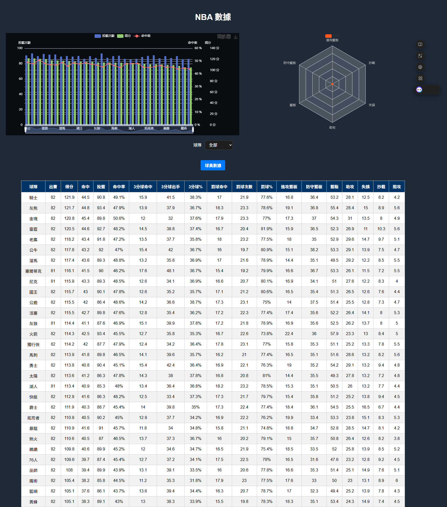
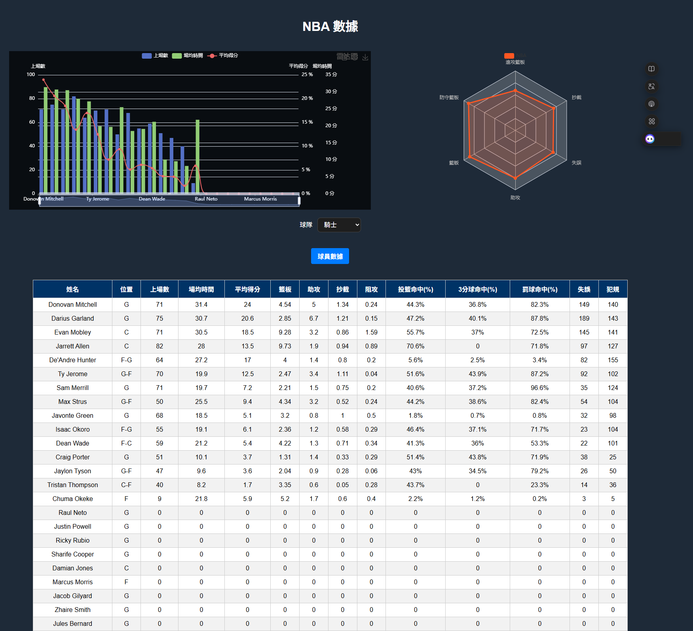
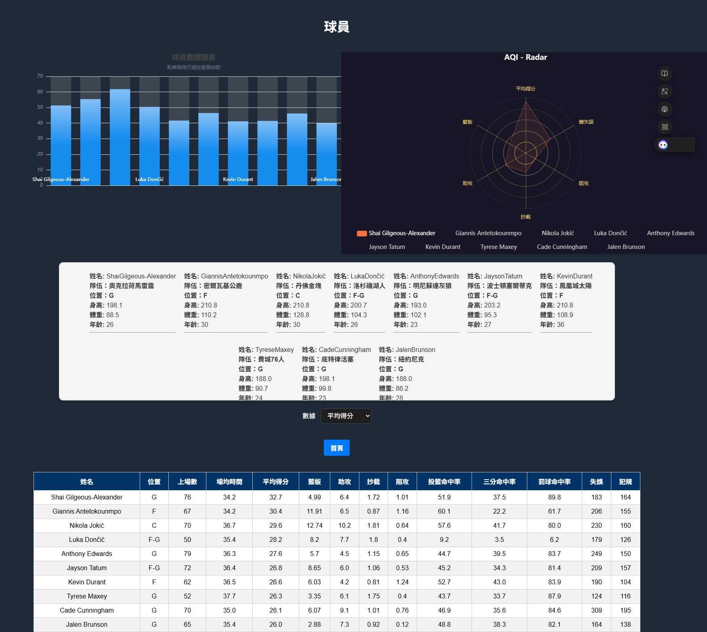

# 🏀 NBA 資料視覺化平台

本專案為一個使用 Python + Flask 所構建的 NBA 統計數據視覺化網站，整合來自 UDN NBA 資料網站 的球隊與球員數據，並透過 MySQL 儲存資料，呈現豐富互動的動態圖表與球員卡片。

資料視覺化使用 ECharts，讓使用者能夠從不同維度（如得分、籃板、助攻等）檢視球隊與球員表現。





---

## 🔧 功能特色

- 🏀 球隊數據概覽（含得分、投籃、命中率等）
- 📊 球隊雷達圖視覺化進攻/防守表現
- 👤 球員列表查詢與排名排序（依據得分、助攻、EFF 等）
- 🧠 自動計算球員效率值（EFF）
- 🏟 支援球隊與球員統計查詢
- 📊 使用 ECharts 呈現得分、投籃、命中率等動態圖表
- 🌐 結合爬蟲與資料庫，動態載入球員基本資料與年齡、身高、體重
- 🧬 顯示球員詳細資訊卡（身高、體重、年齡、所屬球隊）
- 🔗 整合 MySQL 資料庫進行資料儲存與查詢
- ☁️ 可部署至 [Render](https://render.com/) 雲端平台
- 🔐 使用 `.env` 管理敏感資訊

---




## 📁 專案結構

├── app.py # Flask 主程式  
├── nba.py # 資料庫與 API 邏輯  
├── templates/ # HTML 模板  
│ ├── index.html  
│ └── all-player.html  
├── static/  
│ └── style.css  
├── requirements.txt # 套件清單  
└── .env # 資料庫設定（勿上傳）  


## 📁 安裝套件
```bash
flask
pandas
pymysql
python-dotenv
requests
beautifulsoup4
lxml
gunicorn

```

---

## 🚀 快速啟動（本地端）

```bash
git clone https://github.com/dieutoandu/nba-project.git
cd nba-visual-flask

python -m venv venv
source venv/bin/activate    # Windows: venv\Scripts\activate

pip install -r requirements.txt

```
---

## 建立 .env 檔：
- DB_HOST=127.0.0.1
- DB_PORT=3306
- DB_USER=root
- DB_PASSWORD=
- DB_NAME=defaultdb

- python app.py

## 上傳到Render跟啟動

- gunicorn app:app


## 📈 EFF 效率值計算方式
平台自動根據球員各項統計數據，計算出每位球員的綜合效率值（EFF），計算方式如下：

```bash
EFF = 得分 * 1.0 + 籃板 * 1.2 + 助攻 * 1.5 + 抄截 * 2.0 + 阻攻 * 2.0 - (失誤 ÷ 上場數)

```
EFF 越高代表球員在攻守兩端整體貢獻越大，可作為球員排行榜的依據。


## 🧠 補充說明

- 網站資料來源為 UDN NBA 官方網站，透過 BeautifulSoup + lxml 擷取即時更新數據。
- 球員個人頁面由資料庫 all_player_url 對應，每位球員資訊卡皆動態生成。
- 若需更新資料，可使用手動方式重新擷取或額外撰寫更新腳本（非必須）。
- 記得不要將 .env 上傳至 GitHub，建議使用 .gitignore 排除。

